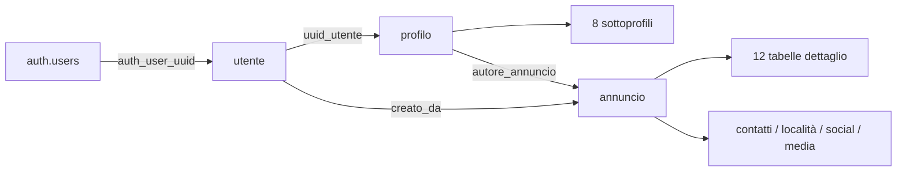

# Punto 0 — Mappa della codebase e delle fonti

## 1. Obiettivo e ambito

Fornire i percorsi e i collegamenti necessari ai successivi punti dell'audit, senza classificare problemi o proporre correzioni del codice. Inventario statico del workspace al **2026-09-25**, commit **`c2d2ab582ef2f2442871fbdab57fffecc8460236`**.

All'avvio: nessuna modifica ai file tracciati; `docs/audit/AUDIT-MASTER.md` già presente e non tracciato. I riferimenti di riga valgono per questa fotografia. Le definizioni locali non attestano lo stato della produzione.

## 2. File e aree analizzate

- `src/app/`, `src/proxy.ts`: pagine, endpoint, layout e metadati.
- `src/features/`, `src/components/`, `src/const/`: moduli funzionali, componenti condivisi e costanti.
- `src/lib/`, `src/server/`: client Supabase, tipi DB, articoli, SEO e query per sitemap.
- `supabase/migrations/`, `supabase/config.toml`, `supabase/templates/`: dichiarazioni SQL, configurazione locale e riferimenti ai template email.
- Manifest, lockfile, configurazioni TypeScript/Next/ESLint/shadcn, `.gitignore`, elenco di `public/aggiornamenti/`, `tests/` e documentazione esistente.

Metodo: inventario dei percorsi, estrazione di dichiarazioni/import/chiamate, letture mirate degli ingressi applicativi; tipi DB letti mediante AST TypeScript e migrazioni esaminate come testo. Nessuna esecuzione di SQL, test applicativi, build o server. Nessuna lettura di `.env.local` o di record utente.

## 3. Mappa ed evidenze di riferimento

### 3.1 Struttura e configurazione

Inventario: **354 file TS/TSX/CSS sotto `src/`**, **18 cartelle feature con sorgenti**, **33 componenti in `src/components/ui/`**, **25 pagine**, **5 Route Handlers**, **32 migrazioni**, **18 file di test**, **12 articoli Markdown**. Sono presenti 78 file con direttiva iniziale `use client` e 8 con `use server`; il conteggio delle direttive non descrive da solo il grafo dei bundle.

| Area | Riferimenti e contenuto |
|---|---|
| Versioni | `package.json:11` dichiara Next `^16.2.10`; il pacchetto installato è **16.3.4**. Installati: React 19.2.4, TypeScript 5.9.3, Tailwind 4.3.2, Base UI 1.6.0, Supabase SSR 0.12.3, supabase-js 2.110.8, Stripe 22.6.2. Fonti: rispettivi `node_modules/<pacchetto>/package.json`; manifest e lockfile restano i riferimenti per le dipendenze. |
| App Router | `src/app/` contiene le pagine; `src/app/layout.tsx:39` compone font, provider, toast, supporto, analytics e consenso. `src/proxy.ts:52` aggiorna la sessione, poi applica manutenzione e gate opzionale; matcher a riga 185. |
| Next e TypeScript | `next.config.ts:4`: limite Server Actions `6mb`. `tsconfig.json:7`: `strict: true`; alias `@/*` verso `src/*`, plugin Next e tipi generati in `.next`. Guide installate in `node_modules/next/dist/docs/`. |
| UI e stile | `components.json:3`: preset `base-nova`, RSC e Lucide. `src/app/globals.css`, `postcss.config.mjs:1`, `src/app/fonts.ts:1`: Tailwind e font Inter/Lato/Oswald. |
| Tooling | `package.json:5`: script dev/build/start/lint; `eslint.config.mjs:5`: configurazioni Next e TypeScript. `.gitignore:33`: area delle regole env. `scripts/` non contiene file diretti nell'inventario. |
| Contenuti e documenti | `public/aggiornamenti/` contiene gli articoli; `src/lib/articles.ts:34` li legge. Riferimenti storici: `README.md`, `docs/supabase-auth-setup.md`, `docs/supabase-schema-review.md`, `docs/campi-pubblicazione-per-profilo.md`, `docs/codici-invito.md`, `docs/fotografia-tecnica-privacy-2026-09-23.md`. |

### 3.2 Route App Router

Accesso descritto dagli ingressi locali, prima degli eventuali gate globali; non è una verifica di autorizzazione. Le route non usano gruppi `(…)`: i percorsi rispecchiano `src/app/`.

| Route | Funzione / accesso osservato | Ingresso |
|---|---|---|
| `/` | Homepage pubblica | `src/app/page.tsx:21` |
| `/annunci` | Directory con filtri e paginazione | `src/app/annunci/page.tsx:48` |
| `/dettagli-annuncio?id=…` | Dettaglio e metadati; loader distingue gli stati del contenuto | `src/app/dettagli-annuncio/page.tsx:69` |
| `/profili` | Directory profili | `src/app/profili/page.tsx:50` |
| `/dettagli-profilo?id=…&type=…` | Dettaglio di un sottoprofilo | `src/app/dettagli-profilo/page.tsx:70` |
| `/aggiornamenti`, `/aggiornamenti/[slug]` | Articoli locali; elenco slug statici | `src/app/aggiornamenti/page.tsx:14`; `src/app/aggiornamenti/[slug]/page.tsx:22` |
| `/partner`, `/contatti` | Pagine informative | `src/app/partner/page.tsx:14`; `src/app/contatti/page.tsx:13` |
| `/termini-di-servizio`, `/privacy-policy`, `/cookie-policy` | Informative tramite componente LegalBlink | Rispettivi `src/app/<route>/page.tsx:14`; `src/components/legal/EmbedLegalBlink.tsx:5` |
| `/accedi`, `/effettua-accesso` | Ingressi login; redirect al profilo se il viewer è presente | `src/app/accedi/page.tsx:22`; `src/app/effettua-accesso/page.tsx:17` |
| `/registrati` | Registrazione/completamento account; redirect se già registrato | `src/app/registrati/page.tsx:28` |
| `/password-dimenticata` | Richiesta recupero | `src/app/password-dimenticata/page.tsx:19` |
| `/reimposta-password` | Form dopo verifica claims, utente e conferma email | `src/app/reimposta-password/page.tsx:20` |
| `/auth/confirm`, `/auth/callback` | Pagine di conferma signup e recupero; chiamano `EmailLinkConfirmation` | Rispettivi `src/app/auth/<route>/page.tsx:17` |
| `/auth/link-non-valido` | Esito link non valido | `src/app/auth/link-non-valido/page.tsx:15` |
| `/il-tuo-profilo` | Richiede account autenticato e registrazione; sezioni profili, annunci, relazioni, salvati e impostazioni | `src/app/il-tuo-profilo/page.tsx:35` |
| `/pubblica-annuncio` | Wizard per account registrati e percorso con verifica email | `src/app/pubblica-annuncio/page.tsx:17` |
| `/pubblica-annuncio/conferma?id=…` | Riepilogo tramite client con sessione | `src/app/pubblica-annuncio/conferma/page.tsx:17`; `src/features/pubblica-annuncio/server/confirmation.ts:86` |
| `/pubblica-annuncio/pagamento` | Pagina di ritorno/avvio checkout; parametri `id`, `result`, `reason`, `session_id` | `src/app/pubblica-annuncio/pagamento/page.tsx:26` |
| `/in-manutenzione` | Pagina gestita anche dal proxy | `src/app/in-manutenzione/page.tsx:14`; `src/proxy.ts:68` |

| Endpoint | Metodo e scopo | Ingresso |
|---|---|---|
| `/api/profili/squadre` | GET, ricerca `q` o risoluzione `ids` | `src/app/api/profili/squadre/route.ts:14` |
| `/api/metadata/annuncio-immagine` | GET con `id`, recupero immagine da Storage tramite backend | `src/app/api/metadata/annuncio-immagine/route.ts:8` |
| `/api/create-checkout-session` | POST, crea/riprende checkout della bozza | `src/app/api/create-checkout-session/route.ts:51` |
| `/api/complete-checkout-session` | POST, riconcilia `announcementId` e `sessionId` | `src/app/api/complete-checkout-session/route.ts:23` |
| `/api/stripe/webhook` | POST, eventi Stripe con controllo firma | `src/app/api/stripe/webhook/route.ts:17` |

Route speciali: `src/app/robots.ts:5`, `src/app/sitemap.ts:33`, `src/app/not-found.tsx`; le pagine dinamiche hanno inoltre file `loading.tsx` dedicati. Gli helper SEO sono `src/server/metadata.ts:47`, `src/server/structured-data.ts:42`, `src/server/sitemap-data.ts:35` e `src/components/seo/JsonLd.tsx`.

### 3.3 Moduli, componenti custom e flussi

| Modulo | UI/modelli principali | Ingressi dati da usare nei prossimi punti |
|---|---|---|
| Auth / accesso / registrazione | `src/features/accedi/`, `src/features/registrati/Registrati.tsx`, `src/features/auth/EmailLinkConfirmation.tsx` | `src/features/auth/server/queries.ts:66`; `src/features/auth/server/actions.ts:26`; `src/features/registrati/server/registration.ts:525` |
| Area personale | `src/features/profilo/IlTuoProfilo.tsx`, `ProfileEditorDialog.tsx`, `ProfileDetailsForm.tsx`, `ProfileImageEditor.tsx` nella stessa cartella | `src/features/profilo/server/queries.ts:304`; `src/features/profilo/server/actions.ts:140`; `src/features/profilo/profile-model.ts:15` |
| Pubblicazione | `src/features/pubblica-annuncio/PubblicaAnnuncio.tsx`, `components/Annuncio*.tsx`, `components/RecapAnnunci/`, `ConfermaPubblicazione.tsx` | `src/features/pubblica-annuncio/server/actions.ts:172`; `server/validation.ts:369`; `publish-model.ts:145`, relativi alla stessa feature |
| Directory e dettaglio annunci | `src/features/annunci/Annunci.tsx`, `DettagliAnnuncioPubblico.tsx`, `components/cards/`, `components/details/`, `announcement-model.ts`, `announcement-content.ts` | `src/features/annunci/server/queries.ts:731` (directory), `:936` (dettaglio), `:592` (ultimi), `:689` (correlati) |
| Directory profili | `src/features/profili/Profili.tsx`, `components/cards/`, `profile-directory-model.ts` | `src/features/profili/server/queries.ts:508`; `src/features/profilo/server/public-team-profiles.ts:87` |
| Dettaglio profilo | `src/features/dettagli-profilo/DettagliProfilo.tsx:18`, `components/types/`, `components/player/`, `components/ProfileDetailsLayout.tsx` | `src/features/dettagli-profilo/server/profile-detail-query.ts:424`; `profile-detail-model.ts` nella feature |
| Follow / salvati | `src/features/interazioni/DetailActions.tsx`, `InteractionButton.tsx`, `DashboardSections.tsx` | `src/features/interazioni/server/actions.ts:14`; `src/features/interazioni/server/queries.ts:28` |
| Segnalazioni / inviti | `src/features/segnalazioni/DetailActions.tsx`, `report-model.ts`; `src/features/inviti/InviteFriendDialog.tsx` | `src/features/segnalazioni/server/actions.ts:70`; `src/features/profilo/server/queries.ts:317`; migrazioni dedicate |
| Homepage / articoli / pagine informative | `src/features/homepage/Homepage.tsx`, `src/features/aggiornamenti/`, `src/features/contatti/`, `src/features/partner/`, `src/features/status-pages/`, `src/features/legal/` | `src/lib/articles.ts:52`; costanti in `src/const/`; `src/features/legal/legal-versions.ts:1` |

**Componente allegato:** `src/features/dettagli-profilo/components/LatestProfileAnnouncements.tsx:8` riceve `AnnouncementDirectoryItem[]` e `announcementsUnavailable`; rende errore, vuoto o lista di `ProfileAnnouncementCard` (`:23` nel file omonimo). I chiamanti sono `components/ProfileDetailsLayout.tsx:33` e `components/types/DettagliProfiloGiocatore.tsx:20`, nella stessa feature. I dati passano da `src/features/dettagli-profilo/server/profile-detail-query.ts:451` a `src/features/annunci/server/queries.ts:861` (`loadPublicProfileAnnouncements`).

**Modelli di categoria:** `src/features/profilo/profile-model.ts:15` elenca giocatore, squadra, staff-sportivo, professionisti-studi, arbitro, creators, torneo-evento, campi-impianti-sportivi. Coming-soon, massimo 5 profili e flag `PROFILI_LIMITATI` sono nello stesso file (`:28`, `:91`, `:95`). Il payload di pubblicazione è versione 3; sei tipologie e quattro sottotipi squadra sono in `src/features/pubblica-annuncio/publish-model.ts:8`; la visibilità proposta dal modello è `gratuito` (`:138`). Sono dichiarazioni da usare come riferimento nel punto 11, non una prova di copertura dei flussi.

**Componenti trasversali:** `src/components/navigation/` (Navbar, Footer, navigazione esterna e sezioni profilo), `loading/PageSkeletons.tsx`, `data-info/StructuredFieldList.tsx`, `support/SupportBubble.tsx` e relativo store Zustand, `SplitText.tsx`, `TextType.tsx`, `styling/GradientBackground.tsx`, `redirects/ComingSoon.tsx`, `redirects/InManutenzione.tsx`. I primitivi condivisi sono in `src/components/ui/`.

### 3.4 Client Supabase e Server Actions

| Confine | Riferimento |
|---|---|
| Browser | `src/lib/supabase/client.ts:5`: `createBrowserClient<Database>`; `src/lib/client.ts:3` è un re-export. |
| Sessione della richiesta | `src/lib/supabase/server.ts:12`: client SSR con cookie; `src/lib/supabase/proxy.ts:6`: aggiornamento sessione. |
| Backend privilegiato | `src/lib/supabase/admin.ts:7`: `createAdminClient`, modulo `server-only`, credenziale server. |
| Viewer applicativo | `src/features/auth/server/queries.ts:66`: claims, utente Auth, `utente` e avatar; `:120` richiede autenticazione. |
| Letture pubbliche tramite backend | Client admin in `src/features/annunci/server/queries.ts:735`, `src/features/profili/server/queries.ts:510`, `src/features/dettagli-profilo/server/profile-detail-query.ts:426`, `src/server/sitemap-data.ts:36` e nei due endpoint GET. |

Gli otto moduli con direttiva `use server` sono:

| Modulo | Operazioni esportate |
|---|---|
| `src/features/auth/server/actions.ts:26` | Login, signup, richiesta recupero, recupero dell'utente corrente, aggiornamento password, logout. |
| `src/features/auth/server/email-link-actions.ts:58` | `completePasswordRecovery`, `completeSignupConfirmation`. |
| `src/features/auth/server/signup-confirmation.ts:26` | Invio e reinvio conferma signup. |
| `src/features/registrati/server/actions.ts:28` | Richiesta e verifica recupero email in registrazione. |
| `src/features/profilo/server/actions.ts:140` | Salva/rimuovi immagine, salva profilo, imposta principale, rimuovi sottoprofilo, visibilità annuncio, consenso newsletter, rimuovi annuncio. |
| `src/features/pubblica-annuncio/server/actions.ts:172` | Richiesta OTP, verifica OTP, pubblicazione. |
| `src/features/interazioni/server/actions.ts:14` | Follow profilo e salvataggio annuncio. |
| `src/features/segnalazioni/server/actions.ts:70` | Invio segnalazione. |

### 3.5 Schema applicativo: tipi locali e tabelle private

`src/server/supabase.ts:8` contiene `Database`, con **34 tabelle e 21 funzioni tipizzate in `public`**, nessuna vista o enum applicativo elencato, più la funzione GraphQL nello schema `graphql_public`. Lo schema `private` non è incluso nei tipi. Questo file descrive il contratto locale; non è un dump verificato del DB remoto.

| Famiglia | Tabelle / collegamenti essenziali | Fonte locale |
|---|---|---|
| Identità | `utente`: UUID interno, `auth_user_uuid`, email/telefono, registrazione, consensi, versioni informative, codice invito | `src/server/supabase.ts:1528` |
| Profilo principale | `profilo`: `uuid`, `uuid_utente`, tipologia principale, foto, nascosto, conferma e verifica | `src/server/supabase.ts:903` |
| Otto sottoprofili | `profilo_giocatore`, `profilo_squadra`, `profilo_staff_sportivo`, `profilo_arbitro`, `profilo_professionista_studente`, `profilo_creator`, `profilo_torneo_evento`, `profilo_campi_impianti`; riferimenti a `profilo` e `sport` | `src/server/supabase.ts:970`, `:1168`, `:1324` |
| Complementi profilo | `localita_profilo`, `link_social_profilo`, `media_profilo`, collegati tramite `uuid_profilo` e identificazione del sottoprofilo | `src/server/supabase.ts:740`, `:804`, `:868` |
| Annuncio principale | `annuncio`: `uuid`, autore profilo, creatore utente, tipologia, stato, visibilità e periodo priorità | `src/server/supabase.ts:42` |
| Dodici dettagli annuncio | `annuncio_generico`, `annuncio_giocatore`, `annuncio_arbitro`, `annuncio_staff_sportivo`, `annuncio_professionista_studente`, `annuncio_creator`, `annuncio_torneo_evento`, `annuncio_campo_impianto`, `annuncio_squadra_cerca_giocatore`, `annuncio_squadra_cerca_staff`, `annuncio_squadra_cerca_partita`, `annuncio_squadra_cerca_sponsor`; collegamento `uuid_annuncio` | `src/server/supabase.ts:118`, `:235`, `:376`, `:584` |
| Complementi annuncio | `contatto_annuncio`, `localita_annuncio`, `link_social_annuncio`, `media_annuncio` | `src/server/supabase.ts:637`, `:711`, `:775`, `:839` |
| Interazioni | `profilo_follow`: profilo follower/seguito; `annuncio_salvato`: utente/annuncio | `src/server/supabase.ts:1135`, `:343` |
| Inviti / catalogo sport | `invito`: invitante/invitato e conferma; `sport`: catalogo collegato ai sottoprofili | `src/server/supabase.ts:666`, `:1483` |

Collegamenti logici principali, da distinguere dai vincoli fisici da verificare nel punto 4:

Le fonti `.sql:riga` nelle tabelle successive sono relative a **`supabase/migrations/`**.

| Tabella privata | Funzione / collegamenti | Definizione iniziale |
|---|---|---|
| `private.registration_intent` | Staging per provisioning registrazione | `20260823154343_registration_profile_provisioning.sql:9` |
| `private.announcement_submission` | Ricevuta di invio, utente, annuncio, consensi e idempotenza; campi checkout/rimborso aggiunti successivamente | `20260824195350_publish_announcement_workflow.sql:36`; `20260911120000_priority_announcement_checkout.sql:21` |
| `private.publish_email_otp_request` | Richieste OTP e limitazione frequenza | `20260825204042_publish_email_otp_rate_limit.sql:7` |
| `private.segnalazioni` | Target annuncio/profilo, segnalatore o hash anonimo, motivazione e data | `20260917124241_segnalazioni.sql:7` |

Il set locale comprende la creazione esplicita di queste quattro tabelle private e di cinque tabelle pubbliche: `contatto_annuncio`, `media_profilo`, `profilo_follow`, `annuncio_salvato`, `invito`. Le altre 29 tabelle pubbliche tipizzate dipendono da uno schema iniziale non definito con `CREATE TABLE` nelle migrazioni disponibili.

### 3.6 RLS e Storage ricostruibili localmente

Inventario delle ultime dichiarazioni letterali `CREATE POLICY` dopo i relativi `DROP POLICY`: **35 policy su 33 tabelle**, senza esecuzione SQL. Non include policy preesistenti nel DB e non prova grant o RLS effettivi in produzione.

| Risorsa | Policy / operazioni descritte nelle migrazioni | Fonte |
|---|---|---|
| `utente`, `profilo` | `utente_select_own`, `profilo_select_own`: SELECT autenticato tramite identità Auth e proprietà | `20260824195359_reconcile_auth_identity_registration.sql:583`, `:590` |
| Otto sottoprofili, `localita_profilo`, `link_social_profilo` | Una `<tabella>_select_own` per tabella, SELECT autenticato collegato al proprietario del profilo | Stessa migrazione: `:604`, `:620`, `:636`, `:653`, `:669`, `:685`, `:701`, `:717`, `:733`, `:749` |
| `annuncio` | `annuncio_select_owned`, `annuncio_update_owned`, `annuncio_delete_owned`; creatore o proprietario del profilo autore | `20260824195359_reconcile_auth_identity_registration.sql:765`, `:787`, `:825` |
| Dodici dettagli annuncio, località/media/social annuncio | Una `<tabella>_select_owned` per tabella; SELECT autenticato con esistenza dell'annuncio collegato | `20260823162929_profile_dashboard_connection.sql:680` e dichiarazioni successive fino a riga 722 |
| `contatto_annuncio` | `contatto_annuncio_select_owned`; SELECT autenticato tramite creatore dell'annuncio | `20260824195350_publish_announcement_workflow.sql:18` |
| `media_profilo` | `media_profilo_select_own`; SELECT autenticato tramite proprietario | `20260923130000_restore_profile_highlights_helpers.sql:37` |
| Follow / salvati | `profilo_follow_select_participant`, `annuncio_salvato_select_owned`; lettura partecipante/proprietario registrato | `20260919115906_profile_follows_and_saved_announcements.sql:41`, `:56` |
| Intent registrazione | `registration_intent_deny_client_access`: restrittiva, ALL per anon/authenticated, `using (false)` | `20260823154731_registration_intent_deny_policy.sql:5` |
| Altre tre tabelle private e `invito` | RLS abilitata e grant/revoke espliciti; nessuna `CREATE POLICY` client individuata per queste risorse | `20260824195350_publish_announcement_workflow.sql:66`; `20260825204042_publish_email_otp_rate_limit.sql:19`; `20260917124241_segnalazioni.sql:64`; `20260924173632_invitation_codes.sql:52` |
| `sport` e schema iniziale | Policy e stato RLS non ricostruibili integralmente dalle sole fonti disponibili | Contratto tabella: `src/server/supabase.ts:1483`; confronto remoto demandato al punto 3 |

Le abilitazioni RLS letterali coprono le nove tabelle create dalle migrazioni; per quelle dello schema iniziale non si deduce lo stato RLS dai soli tipi. La mappa distingue inoltre le letture delle pagine tramite client admin (§3.4) dalle policy per accesso diretto.

| Bucket | Configurazione dichiarata | Codice di accesso |
|---|---|---|
| `immagini_annunci` | Privato; PNG/JPEG/WebP, massimo 5 MiB. `20260910120000_publish_announcement_refactor.sql:10` | Upload/rimozione backend: `src/features/pubblica-annuncio/server/actions.ts:36`; download tramite endpoint: `src/app/api/metadata/annuncio-immagine/route.ts:8`. |
| `immagini_profili` | Pubblico; WebP, massimo 2 MiB. `20260916160000_profile_images.sql:43`; a riga 65 vengono rimosse tre policy di scrittura su `storage.objects`. | `src/features/profilo/profile-image.ts:3`; elaborazione Sharp in `src/features/profilo/server/profile-image-processing.ts:10`; azioni immagini a `server/actions.ts:140` nella stessa feature. |

Nessuna nuova `CREATE POLICY` su `storage.objects` è presente nel set di migrazioni esaminato; non è una dichiarazione sull'assenza di policy nel progetto remoto.

### 3.7 RPC, trigger e indice delle migrazioni

Quattordici nomi RPC sono chiamati letteralmente dai sorgenti. I tipi ne dichiarano ulteriori, comprese versioni precedenti e helper: `src/server/supabase.ts:1587`.

| Famiglia | RPC chiamate | Chiamanti |
|---|---|---|
| Registrazione | `prepare_registration`, `complete_registration_v1`, `cancel_registration`, `get_registration_email_identity_v1` | `src/features/auth/server/actions.ts:168`, `:215`, `:239`; `src/features/registrati/server/email-identity.ts:16` |
| Sottoprofili | `save_owned_subprofile_with_social_links_v1`, `set_owned_primary_subprofile`, `delete_owned_subprofile` | `src/features/profilo/server/actions.ts:341`, `:382`, `:423` |
| Pubblicazione | `consume_publish_email_otp_request_v1`, `publish_announcement_v2` | `src/features/pubblica-annuncio/server/actions.ts:146`, `:430` |
| Checkout / rimborso | `get_owned_priority_checkout_v1`, `record_priority_checkout_session_v1`, `record_priority_checkout_event_v1`, `record_priority_refund_v1` | `src/features/pubblica-annuncio/server/stripe-checkout.ts:124`, `:209`, `:248`, `:285` |
| Segnalazioni | `submit_segnalazione_v1` | `src/features/segnalazioni/server/actions.ts:92` |

Indice compatto per cercare solo le migrazioni pertinenti. I prefissi identificano i file dentro `supabase/migrations/`; leggerli in ordine cronologico, seguendo anche `ALTER FUNCTION … RENAME TO`.

| Area | Prefissi delle migrazioni (tutti i 32 file) |
|---|---|
| Provisioning, policy, dashboard, identità Auth | `20260823154343`, `20260823154731`, `20260823162929`, `20260824195359` |
| Invio annuncio e OTP | `20260824195350`, `20260825204042` |
| Identità email | `20260907152850`, `20260907154436` |
| Pubblicazione, date, grant validatore | `20260910120000`, `20260910130000`, `20260916101037` |
| Checkout e riconciliazione importi | `20260911120000`, `20260914130000`, `20260914140000` |
| Highlights, categorie, ricerca squadre, immagini | `20260912120000`, `20260916124717`, `20260916143000`, `20260916160000` |
| Segnalazioni, social, interazioni, ruoli | `20260917124241`, `20260918224544`, `20260919115906`, `20260921212157` |
| Consensi, ripristino helper/core, salvataggio atomico, campi obbligatori | `20260923105600`, `20260923120000`, `20260923130000`, `20260923212945`, `20260923214641`, `20260923222553` |
| Sospensione priorità, snapshot/date, inviti, verifica profilo | `20260924120000`, `20260924122000`, `20260924173632`, `20260924193443` |

Trigger individuati: provisioning e aggiornamento email Auth, aggiornamento visibilità annuncio, ciclo di vita priorità, date di nascita, pulizia highlights, stabilità/conferma inviti e sincronizzazione conferma email del profilo. Ingressi SQL: `20260824195359_reconcile_auth_identity_registration.sql:445`, `20260912120000_profile_highlights_and_minimum_age.sql:363`, `20260924173632_invitation_codes.sql:31`, `20260924193443_distinguish_profile_verification.sql:60`. Estensioni dichiarate: `pg_trgm` nella migrazione `20260916143000`; `pg_cron` e scheduling della scadenza priorità in `20260911120000_priority_announcement_checkout.sql:633`. Presenza e attivazione remote non verificate.

### 3.8 Variabili d'ambiente e integrazioni

Inventario dei nomi effettivamente referenziati tramite `process.env` nei sorgenti; nessun valore locale o remoto è stato letto.

| Nome | Uso e riferimento |
|---|---|
| `NEXT_PUBLIC_SUPABASE_URL` | URL client browser, SSR, proxy e admin; `src/lib/supabase/client.ts:7`, `src/lib/supabase/admin.ts:8`. |
| `NEXT_PUBLIC_SUPABASE_PUBLISHABLE_KEY` | Credenziale pubblica browser/SSR/proxy; `src/lib/supabase/client.ts:8`. |
| `SUPABASE_SECRET_KEY` | Client admin server; `src/lib/supabase/admin.ts:9`. |
| `NEXT_PUBLIC_SITE_URL` | Origine per link Auth, SEO e ritorno checkout; `src/features/auth/utils.ts:24`, `src/server/metadata.ts:31`, `src/features/pubblica-annuncio/server/stripe-checkout.ts:88`. |
| `NEXT_PUBLIC_MAINTENANCE_MODE` | Flag manutenzione; `src/proxy.ts:8`. |
| `SITE_ACCESS_ENABLED` | Attivazione gate; `src/proxy.ts:11`. |
| `SITE_ACCESS_SECRET` | Token del gate; `src/lib/site-access.ts:12`. |
| `STRIPE_SECRET_KEY` | Client Stripe server; `src/features/pubblica-annuncio/server/stripe-checkout.ts:79`. |
| `STRIPE_ANNUNCIO_PRIORITARIO_PRICE_ID` | Identificativo prezzo; stesso file, riga 99. |
| `STRIPE_WEBHOOK_SECRET` | Verifica webhook; `src/app/api/stripe/webhook/route.ts:19`. |
| `NODE_ENV` | Comportamento URL Auth e cookie segnalazioni; `src/features/auth/utils.ts:37`, `src/features/segnalazioni/server/actions.ts:64`. |

`supabase/config.toml` è configurazione **locale**: schemi API `public` e `graphql_public` (`:13`), `schema_paths = []` (`:64`), URL Auth locali (`:159`), conferma email (`:226`), OTP a sei cifre (`:232`) e template confirmation/magic_link/recovery (`:236`). Non dimostra la configurazione hosted.

I riferimenti env aggiuntivi nel TOML sono `OPENAI_API_KEY` per Studio (`:101`), `SUPABASE_AUTH_SMS_TWILIO_AUTH_TOKEN` e `SUPABASE_AUTH_EXTERNAL_APPLE_SECRET` in sezioni provider disabilitate (`:306`, `:338`), e `S3_HOST`, `S3_REGION`, `S3_ACCESS_KEY`, `S3_SECRET_KEY` nella sezione sperimentale (`:411`). `SECRET_VALUE` e `SENDGRID_API_KEY` compaiono in esempi commentati (`:57`, `:254`, `:398`), non come requisiti dell'applicazione.

Altre integrazioni: Vercel Analytics/Speed Insights e script CMP LegalBlink in `src/app/layout.tsx:6`, `:62`; informative in `src/components/legal/EmbedLegalBlink.tsx:5`; highlights YouTube in `src/features/dettagli-profilo/components/player/PlayerOverview.tsx:13`; contatti e link social in `src/const/contactConstants.ts:1`. L'invio email passa da Supabase Auth e dai template in `supabase/templates/`; il provider SMTP hosted non è stato accertato.

### 3.9 Test esistenti e punti di partenza delle prossime sessioni

I nomi seguenti sono relativi a `tests/`; sono inventariati, non eseguiti.

| Area | File `.test.mjs` |
|---|---|
| Card, dettagli, squadra | `announcement-cards`, `announcement-details`, `profile-details`, `team-profile` |
| Auth e consensi | `auth-email-flow`, `registration-consents`, `registration-consents-database` |
| Pubblicazione | `publish-field-validation`, `publish-announcement-types-database`, `publish-announcement-reconciliation`, `priority-announcements-paused` |
| Interazioni / segnalazioni | `interactions`, `interaction-database`, `segnalazioni` |
| Altre migrazioni | `player-role-migration`, `profile-verification-database`, `invitation-codes-database` |
| SEO | `metadata` |

I test usano `node:test`; alcuni caricano TypeScript o verificano sorgenti, altri usano PGlite isolato. Esempi: `tests/announcement-details.test.mjs:19`, `tests/interaction-database.test.mjs:7`. Il runner PGlite opzionale nella cache `node_modules/.cache/interaction-tests/` risulta presente; nessun test è stato avviato. I comandi documentati sono in `README.md:131`.

| Punto successivo di audit | Partire da |
|---|---|
| 1 — Segreti | §3.8, `.gitignore`, file tracciati e artefatti pertinenti; inventario dei soli nomi env già disponibile. |
| 2 — Sicurezza server | §3.2 e §3.4: cinque endpoint, otto moduli Action, proxy, viewer e parser di registrazione/pubblicazione. |
| 3–4 — Supabase / DB | §3.5–3.7, tipi DB, prefissi delle migrazioni e limiti remoti sotto indicati. |
| 5 — Stripe | Tre endpoint POST, `src/features/pubblica-annuncio/server/stripe-checkout.ts`, migrazioni checkout e sospensione. |
| 6 — Privacy | Identità/contatti/media/consensi (§3.5), integrazioni (§3.8), azioni profilo e documento privacy storico. |
| 7–8 — Qualità / performance | Confini client (§3.4), query delle directory/dettagli (§3.3), cache sitemap, immagini e componenti animati. |
| 9–10 — SEO / accessibilità | Metadati e pagine (§3.2), layout, navigazione, form, UI condivisa e animazioni (§3.3). |
| 11–12 — Roadmap / pulizia | Tipologie e flag (§3.3), inventario feature, documenti storici, configurazioni e test (§3.1, §3.9). |

## 4. Checklist azioni

La checklist raccoglie le verifiche residue della mappa, assegnate ai punti previsti dal master.

### Eseguibili da agente AI

- [ ] Nei punti 3–4 confrontare questa mappa con cataloghi, policy, grant, bucket e storico migrazioni remoti se diventa disponibile un accesso configurato in lettura.
- [ ] Nei punti successivi verificare solo i file pertinenti e le differenze rispetto al commit indicato; aggiornare nei rispettivi report gli eventuali riferimenti cambiati.

### Da fare manualmente dall'utente

- [ ] Se serve una verifica del progetto effettivo, rendere disponibile una connessione in lettura o esportazioni dei soli metadati, specificando l'ambiente; non inserire credenziali o dati personali nei report.
- [ ] Per i punti 6, 9 e 11 confermare dalle impostazioni dei servizi ciò che non è ricavabile dal repository: SMTP, consenso/analytics e Search Console.

## 5. Domande aperte e limiti delle fonti

- **Remoto non verificato:** nessun tool Supabase dedicato esposto, CLI Supabase/psql non rilevati e `mcp__webstorm__list_database_connections` ha restituito `connections: []`. Nessun tentativo di connessione REST diretta né lettura di dashboard o dati hosted.
- **Schema iniziale:** i tipi danno nomi, campi e relazioni, ma non ricostruiscono integralmente grant, RLS, trigger, vincoli e impostazioni. Resta da identificare la fonte autorevole dello schema iniziale e lo storico realmente applicato.
- **Ambiente:** il sito pubblico è confermato dall'utente; corrispondenza tra workspace, deploy e progetto DB, configurazione SMTP e stato runtime dei gate non sono stati verificati.
- **Copertura:** mappa di struttura e collegamenti, non valutazione di sicurezza, funzionalità, accessibilità o performance. Non si anticipano findings dei punti successivi.

## 6. Stato finale e collegamento successivo

**Completato il 2026-09-25**, per la mappa locale e l'individuazione delle fonti e dei limiti remoti. Nessun codice, configurazione applicativa o database modificato; scritti soltanto questo report e l'aggiornamento del master.

Prossimo: **Punto 1 — Segreti, dati nei file e tracciamento Git**, report previsto `01-segreti-git.md`; ancora **Da fare**. Riprendere dal [master e dalla tabella di stato](AUDIT-MASTER.md#tabella-di-stato).
